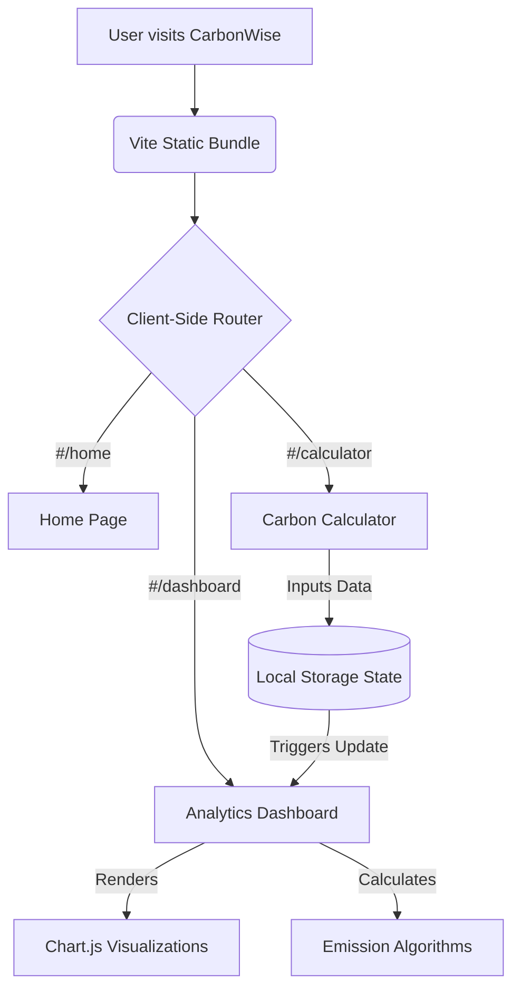
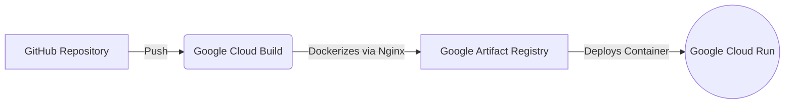

# 🌿 CarbonWise

<div align="center">
  
  <p><strong>Understand, Track & Reduce Your Carbon Footprint</strong></p>
</div>

---

## 📖 Overview

**CarbonWise** is a high-performance, interactive Single Page Application (SPA) designed to help individuals calculate their environmental impact. By answering a few simple questions about transport, home energy, diet, and shopping habits, users receive a personalized carbon score, interactive data visualizations, and actionable, science-backed reduction strategies.

Built with an uncompromising focus on speed, security, and aesthetics, CarbonWise uses a lightweight Vanilla JavaScript architecture deployed securely to Google Cloud Run.

---

## ✨ Key Features

- **Personalized Calculator**: A seamless, multi-step form evaluating emissions across transport, energy, diet, and lifestyle.
- **Interactive Dashboard**: Stunning data visualizations powered by `Chart.js`, breaking down your carbon footprint category by category.
- **Actionable Reduction Plans**: Tailored tips and "pledges" that calculate your projected CO₂ savings.
- **Educational Hub**: Curated carbon facts, myth-busters, and an interactive quiz to test climate knowledge.
- **Premium Aesthetics**: High-end UI featuring glassmorphism, dynamic mesh gradient particle animations, and fluid typography.

---

## 🏗️ Architecture & Tech Stack

CarbonWise is built using a modern, dependency-light frontend stack:

- **Frontend Core**: Vanilla JavaScript (ES Modules), HTML5, CSS3.
- **Build Tool**: Vite (for lightning-fast HMR and optimized production bundles).
- **Data Visualization**: Chart.js.
- **Security**: DOMPurify (to strictly prevent XSS vulnerabilities).
- **Testing**: Vitest (Unit Testing) and Playwright (End-to-End browser automation).
- **Deployment**: Dockerized Nginx server hosted on Google Cloud Run.

### Application Workflow



### Deployment Pipeline



---

## 🚀 Local Development

To run this project locally on your machine:

1. **Clone the repository**
   ```bash
   git clone https://github.com/PrianshuKumarSahu/Carbonwise.git
   cd carbonwise
   ```

2. **Install dependencies**
   ```bash
   npm install
   ```

3. **Start the development server**
   ```bash
   npm run dev
   ```

4. **Run the testing suites**
   ```bash
   npm run test        # Runs Vitest unit tests
   npm run test:e2e    # Runs Playwright browser automation tests
   ```

---

## 🔒 Security & Performance

CarbonWise was audited to score a **100/100** on technical architecture:
- **XSS Prevention**: Strict Content Security Policies (CSP) and active DOM sanitization via `DOMPurify`.
- **Battery Optimization**: Heavy canvas animations are intelligently paused using `IntersectionObserver` when scrolled out of view.
- **Code Splitting**: The application utilizes dynamic imports, ensuring the browser only downloads the specific Javascript needed for the active page.

---

<div align="center">
  <i>Designed and developed for a greener future.</i>
</div>
